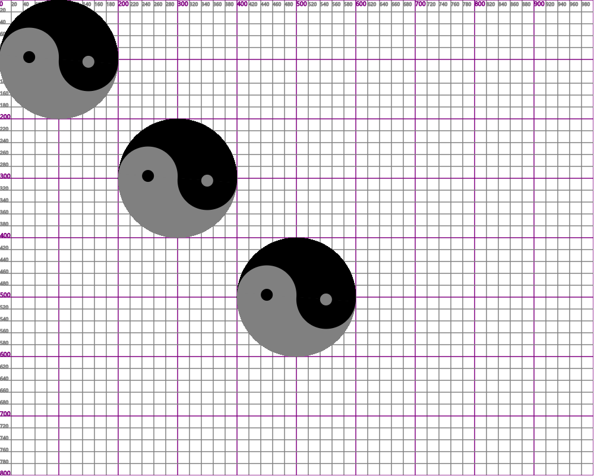
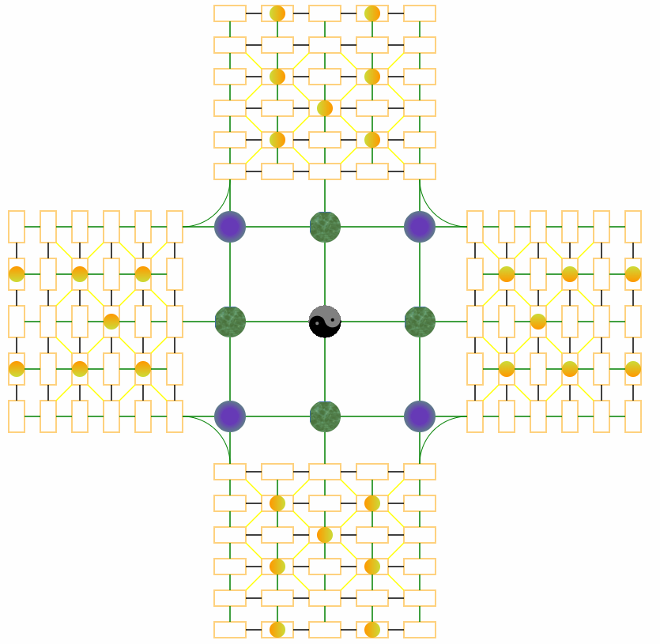

# canvasExample

1. 太极图(taiji.html)


结构：

* 背景标尺(ruler.js)
    * 默认属性
        * 宽1000
        * 高900
        * x轴：起始0，间隔20，高亮间隔100
        * y轴：起始0，间隔20，高亮间隔100
* 太极原型(taijiball.js)
    * 属性
        * 大小
        * x、y轴偏移量
    * 方法
        * 画图
* 太极画布(taiji.js)
    * 属性
        * 画布
        * 上下文
        * 太极原型数组
        * 太极数量
    * 方法
        * 新增
        * 转动动画


2. 四国军棋棋盘(sgjq.html)


结构：

* 四国军棋地图(sgjqmap.js)
    * 画整幅地图 drawMap
        * 画4个方向的私有地图 drawAllPrivateMap
            * 画单个私有地图，再旋转绘制 drawPrivateMap
                * 画圆 drawCircle
                * 画方 drawRect
                * 画水平线 drawHorizontalLine
                * 画垂直线 drawVerticalLine
                * 画斜线 drawOneLRObliqueLine
        * 画中间公共部分地图 drawAllPublicMap
            * 画圆 drawPublicCircle
            * 画线 drawPublicLine
            * 画弧 drawPublicArc
            * 画太极 taijiCanvas

3. 知识点

* 创建画布
```html
<canvas id="background-map" style="display:block;"></canvas>
```
```js
var canvas = document.getElementById("background-map");
canvas.width = "1000";
canvas.height = "900";
var ctx = canvas.getContext("2d");
```
首先需要在html写出canvas标签，然后再js中获取canvas的DOM节点，设置canvas大小后，可再获取canvas的上下文，用于以后的绘制。

* 画布的坐标系

画布的原点(0,0)在左上角，x轴向右递增，y轴向下递增。

* 设置颜色
```js
ctx.strokeStyle = "red";
var linearGradient = ctx.createLinearGradient(渐变起点x坐标, 渐变起点y坐标, 渐变结束点x坐标, 渐变结束点y坐标);
//var radialGradient = ctx.createLinearGradient(渐变起点x坐标, 渐变起点y坐标, 渐变起点半径, 渐变结束点x坐标, 渐变结束点y坐标, 渐变结束点半径);
linearGradient.addColorStop(0, "#FF9800");
linearGradient.addColorStop(1, "#CDDC39");
//radialGradient.addColorStop(0, "#FF9800");
//radialGradient.addColorStop(1, "#CDDC39");
ctx.fillStyle = linearGradient;
//ctx.fillStyle = radialGradient;
```
通过设置strokeStyle，可以改变线条颜色，当已经设置颜色后，下一次画图案不设置颜色，则表示使用原来的颜色；

createLinearGradient可设置线性渐变，通过改变参数坐标点，可实现横向线性渐变、纵向线性渐变、斜向线性渐变，createLinearGradient可设置径向渐变；

addColorStop可设置颜色断点，要注意第一个参数值介于0-1之间，表示距离起点占全程的百分比，0表示0%，1表示100%；

fillStyle用来定义填充渐变颜色。

* 画各种线
```js
ctx.beginPath();
ctx.moveTo(起始点x坐标, 起始点y坐标);
ctx.lineTo(结束点x坐标, 结束点y坐标);
ctx.closePath();
ctx.stroke();
```
告诉上下文要开始画线了，然后移动到起始点，连接到结束点，结束路径，最后画线。上文图中看似复杂的横线、竖线、斜线，都可以这样画出来。

* 画弧和画圆
```js
ctx.beginPath();
ctx.arc(圆心x坐标, 圆心y坐标, 圆半径, 弧度起始{如0}, 弧度结束{如Math.PI * 2});
ctx.closePath();
ctx.fill();
```
画弧和画圆本质上是一样的，它们的填充颜色(fill)可设置渐变，弧的填充需要注意路径闭合，也可以只描线(stroke)，也可两者混合。

* 填充纹理
```js
var img = new Image();
    img.src = "1.png";
    img.onload = function () {
        var pattern = ctx.createPattern(img, "no-repeat");
        ctx.fillStyle = pattern;
        ...
        ctx.fill();
    }
```

* 变换与状态保存
```js
ctx.save();
ctx.translate(平移的x坐标,平移的y坐标);
ctx.rotate(弧度);
ctx.scale(x轴放大比例,y轴放大比例) : 将canvas画布进行缩放显示
ctx.restore();
```
保存save：保存当前画布状态

平移translate：将画布坐标原点移动到(x,y)的位置，如果再次平移，则会按上一个平移之后的原点作为原点参考。

旋转rotate：将画布旋转指定弧度，若要传入度数，可传{度数 * Math.PI / 180}。

缩放scale：将画布进行缩放显示。

恢复restore：恢复画布成上一次save状态


